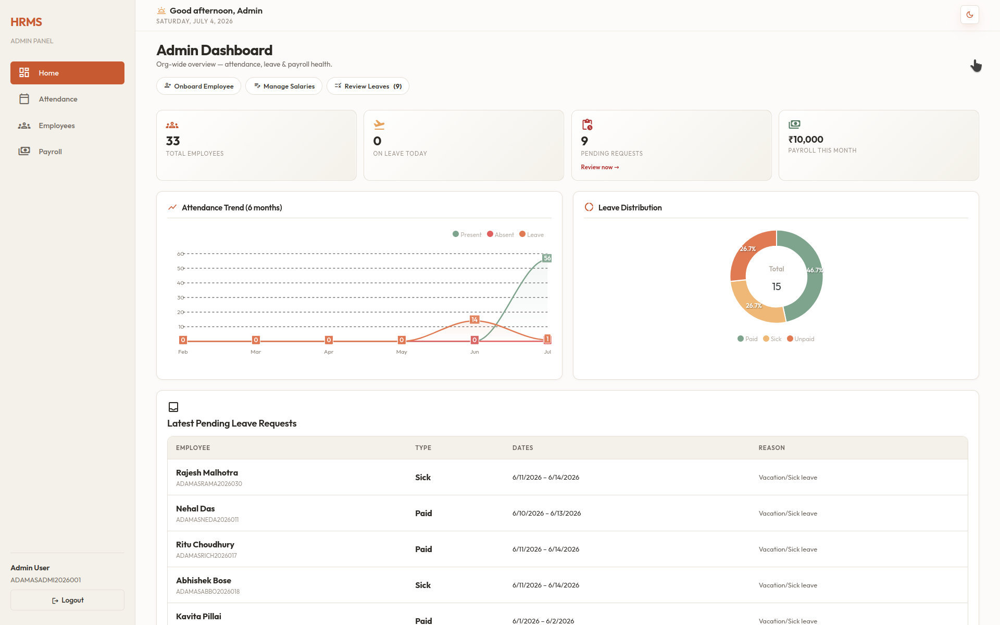
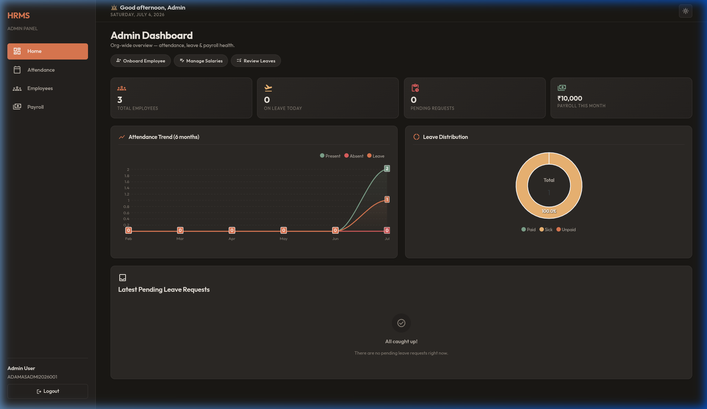
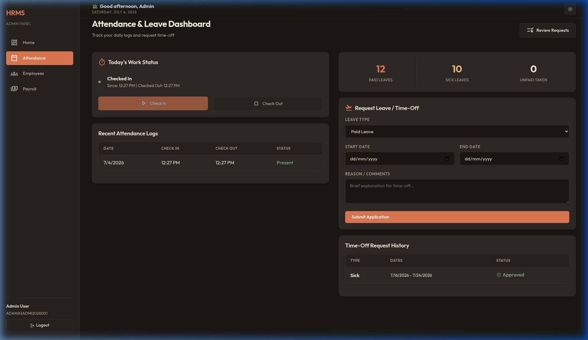
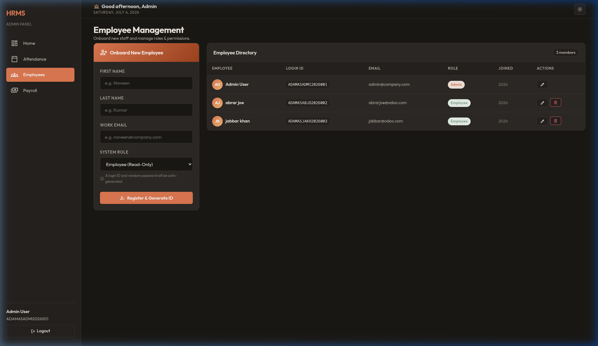
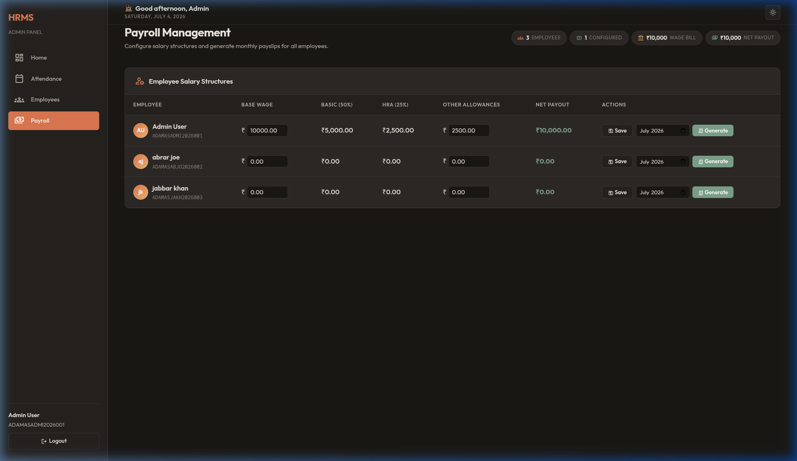
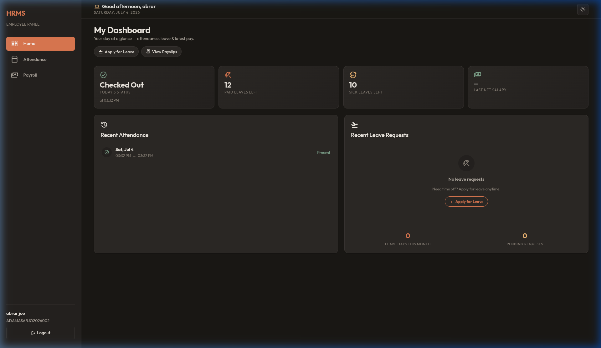
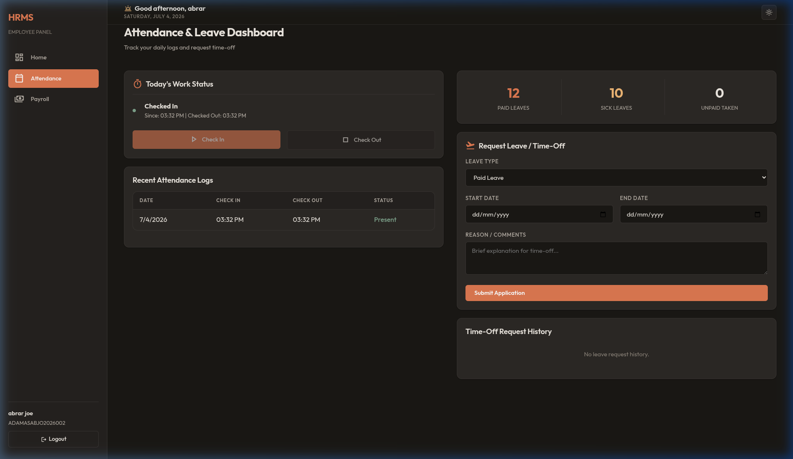
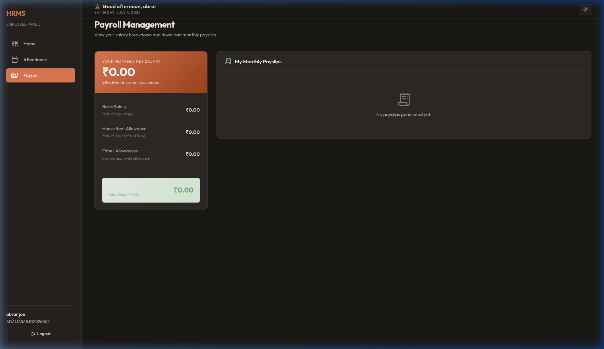

# Human Resource Management System (HRMS)

A premium, human-centric Human Resource Management System designed for the Odoo x Adamas University Hackathon 2026. The platform utilizes a warm terracotta, amber, and cream color palette to create an organic, modern, and high-density enterprise dashboard. Built using Node.js, Express, EJS templating, and PostgreSQL.

## Core Features

- **Dashboard Engine**: Custom analytics panels rendering data visualizations through lightweight ApexCharts.
- **Attendance Integration**: Automated check-in/check-out logs, real-time presence tracking, and auto-calculated work duration metrics.
- **Dynamic Leave Management**: Leave request routing with multi-level approval stages. Automatically calculates date spans and deducts balances from employee records upon approval.
- **Payroll Processing**: Automated payslip generator with transactional calculation logic. Deducts unpaid leave or absent days directly from base wages (holiday salary cuts).
- **Enterprise Onboarding**: System generated Login IDs and unique, random temporary passwords.
- **Demo Utility Panel**: Built-in credential helper sheet displaying newly onboarded accounts and active user lists to streamline hackathon presentations.

## Interface Demos

### Tutorial Walkthrough Video
A full video tutorial guide showing login workflows, theme switching, onboarding, leave approvals, and payroll calculations is included in the project deliverables.

### System Interactions & Tour
A recorded session showing credentials lookup, logins, navigation states, check-in flows, and data updates across panels.


### Light Mode Overview
The system supports full runtime theme-switching to accommodate varying preferences, leveraging warm earthy accents in light settings.



---

### Admin Portal Sections

#### Dashboard Overview
A comprehensive hub tracking total headcounts, presence ratios, ongoing leaves, and total wage bills alongside visual metrics.


#### Attendance & Leave Control
Management center for processing check-ins, tracking presence statuses, and reviewing pending leaves.


#### Employee Directory & Onboarding
User management suite containing onboarding forms with system ID generators and active directories.


#### Payroll & Base Wage Setup
System configuration tools for base wages, basic components, HRAs, and allowances.


---

### Employee Portal Sections

#### Employee Dashboard
Personal employee dashboard offering summary cards, shortcuts, and presence status indicators.


#### Personal Attendance & Time-Off Requests
Logs showing clock timings, work hours, presence tracking, and leave request submission forms.


#### Personal Payslip History
Monthly salary metrics, breakdown allowances, deductions, and downloadable payslips.


## Tech Stack

- **Backend**: Node.js, Express.js
- **Database**: PostgreSQL (pg client)
- **Templating**: EJS (Embedded JavaScript)
- **Styling**: Custom CSS (supporting light and dark mode toggles)
- **Data Visualization**: ApexCharts

## Setup Instructions

### Prerequisites
- Node.js (version 18 or higher)
- PostgreSQL (running locally or remotely)

### Database Configuration
1. Initialize the schema using the provided SQL file:
   ```bash
   psql -U postgres -d hrms -f database/schema.sql
   ```
2. By default, the schema setups default admin and employee seeds.

### Environment Setup
Create a `.env` file in the root directory:
```env
PORT=3000
DB_USER=postgres
DB_HOST=localhost
DB_NAME=hrms
DB_PASSWORD=your_postgres_password
DB_PORT=5432
SESSION_SECRET=your_secure_secret
COMPANY_CODE=ADAMAS
```

### Installation & Run
1. Install dependencies:
   ```bash
   npm install
   ```
2. Start the development server:
   ```bash
   npm run dev
   ```
3. Open `http://localhost:3000` in your web browser.
